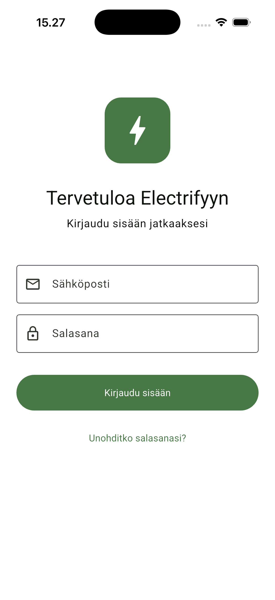
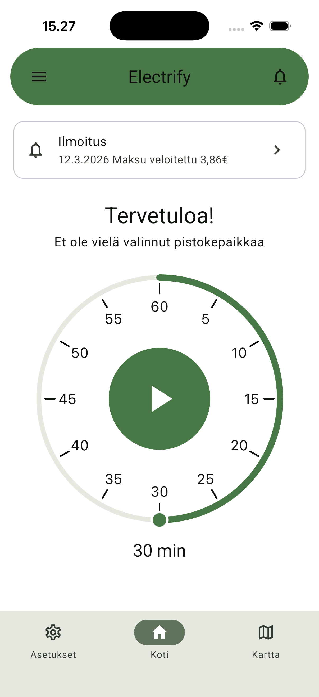
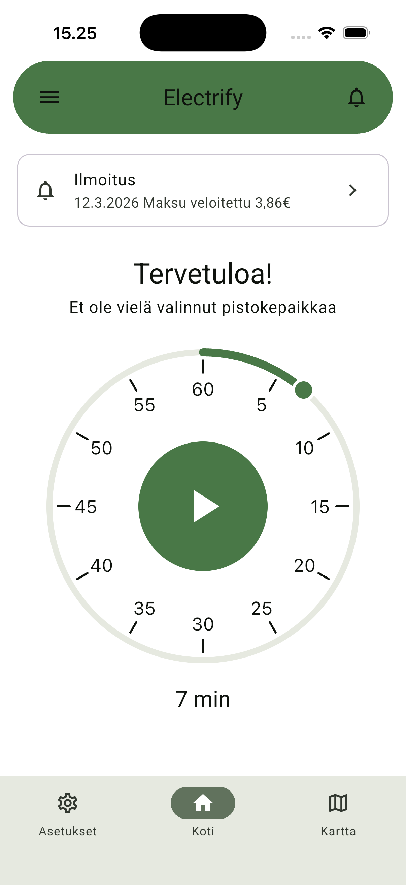
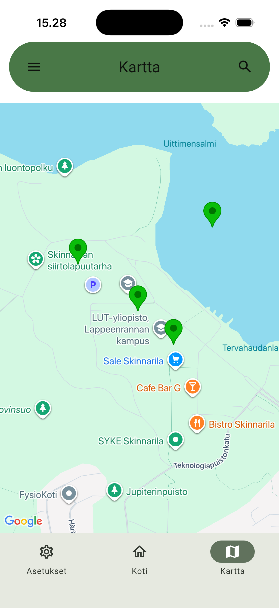
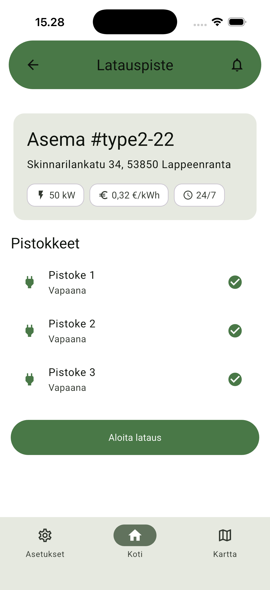
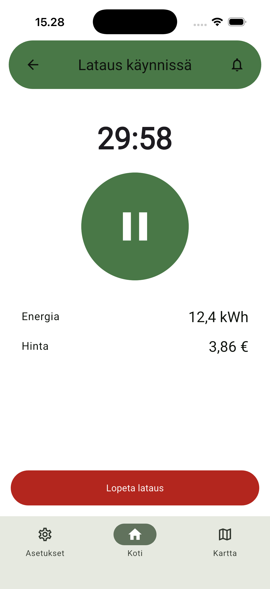
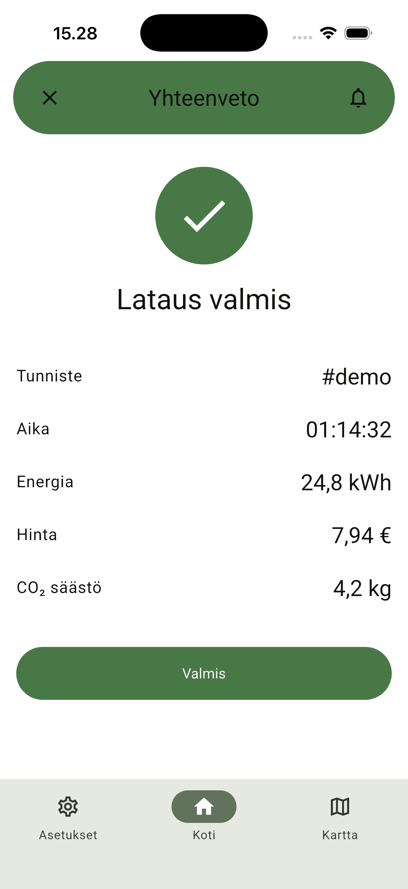

# Electrify

A Flutter visual + navigation scaffold for an EV charging app, built from a Finnish Figma source. The UI is in Finnish; routing, theming, and shared chrome are wired up. Backend, BLE, payments, and persistence are intentionally **not** wired yet — see `CLAUDE.md` for the in-scope/out-of-scope rules.

## Stack

- **Flutter** (managed via [FVM](https://fvm.app/), pinned in `.fvmrc`) · **Dart** `^3.11.4`
- **Riverpod** `flutter_riverpod ^3.3.1` for state
- **go_router** `^17.2.0` with `StatefulShellRoute.indexedStack` for tab-scoped back stacks
- **Material 3** with a hand-tuned `ColorScheme` from Figma (`material-theme/sys/light-medium-contrast`)
- **Roboto** via `google_fonts`

## Screens

| Login | Home — dial at 30 min default | Home — dial mid-drag |
|---|---|---|
|  |  |  |

| Map | Latauspiste (connectors) | Lataus käynnissä |
|---|---|---|
|  |  |  |

| Yhteenveto |
|---|
|  |

The home dial is a custom interactive widget — drag to set the charging duration in 1-minute steps (haptic tick on every minute, multi-rotation up to 3 hours). The active-charging screen runs a real countdown with a play/pause toggle.

## Run

All Flutter commands go through FVM:

```bash
fvm flutter pub get          # install dependencies
fvm flutter run              # launch on the connected device
fvm flutter analyze          # static analysis
fvm flutter test             # run all tests
```

## Layout

Feature-first under `lib/`:

```
lib/
  main.dart            # runApp(ProviderScope(child: ElectrifyApp()))
  app.dart             # MaterialApp.router wiring theme + appRouter
  core/
    router/            # GoRouter + path constants
    theme/             # AppColors, AppTypography, AppTheme
    widgets/           # XrAppBar, XrBottomNav, XrAppDrawer
  features/
    auth/              # login
    charging/          # connector, active charging, location, summary
    history/           # charging history + details
    home/              # home + LocationDial widget
    map/               # map + search
    notifications/     # notifications list
    profile/           # Asetukset (settings)
```

See `CLAUDE.md` for detailed conventions and the routing model.

## License

This project is licensed under the **GNU General Public License v3.0** — see the [LICENSE](LICENSE) file for the full text.
